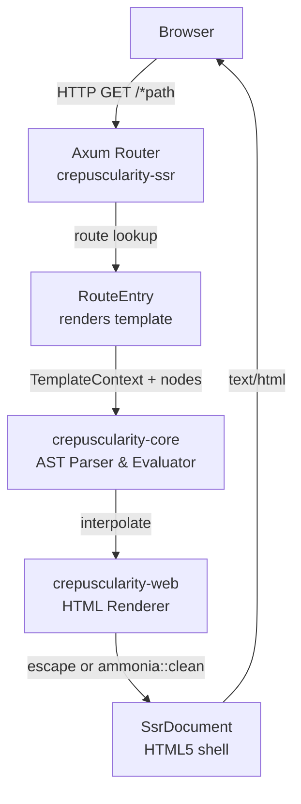
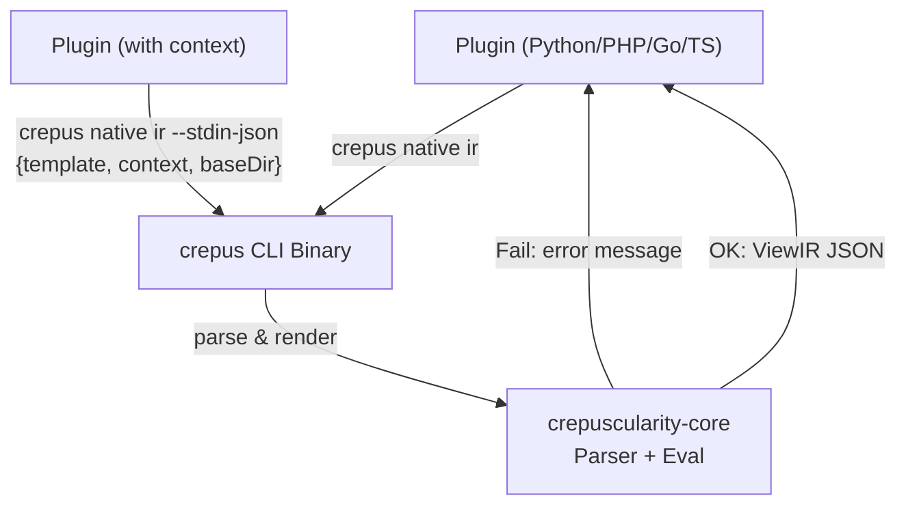
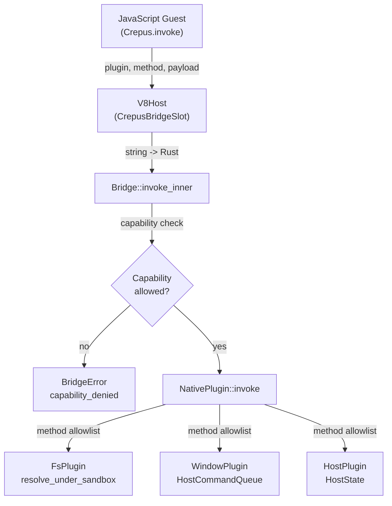
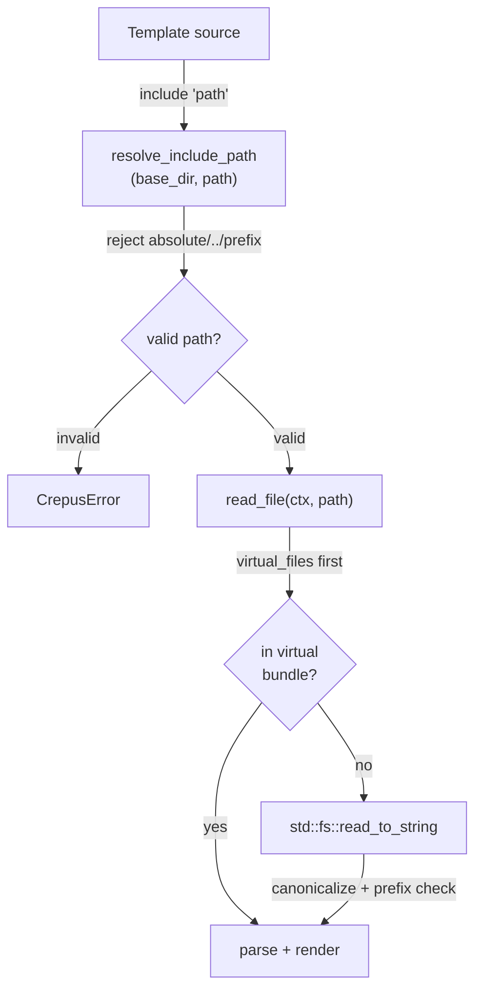

# Phase L2 — Knowledge Base & Threat Model

Generated by piolium balanced audit
`2026-06-25T05:12:45Z` → `2026-06-25`

**Target:** `tschk/crepuscularity` @ `main` (`74c3965f`)
**Audit ID:** `2026-06-25T05:07:30.834Z`

---

## Project Classification

**Type:** Framework + CLI tool + Cross-platform UI SDK (polyglot)

Crepuscularity is a template-driven UI framework that renders a custom `.crepus` DSL (Domain-Specific Language) into multiple target backends: server-side HTML (SSR via Axum), client-side WASM (DOM manipulation via `wasm-bindgen`), native desktop (GPUI), terminal (Ratatui), mobile (iOS SwiftUI / Android Jetpack Compose via View IR), and embedded (LVGL, RGB565 framebuffers). It includes a CLI (`crepus`) for scaffolding, building, and hot-reloading projects across all targets.

**Sub-types:** CLI tool, library (Rust crate workspace), code generator, hot-reload dev server, browser extension SDK, language server (LSP).

---

## Architecture Model

### Topology Overview

The project is a Rust workspace of ~20 crates plus polyglot plugin bindings (Python, PHP, Go, TypeScript/Bun, Ruby, Zig, C, C++, C#, Java, Kotlin, Swift) that all shell out to the `crepus` CLI binary via subprocess.

```
┌─────────────────────────────────────────────────────────────┐
│                      User / Developer                        │
│  (edits .crepus files, runs CLI, deploys SSR, installs ext)  │
└─────────┬───────────┬──────────────┬───────────────┬─────────┘
          │           │              │               │
          ▼           ▼              ▼               ▼
   ┌──────────┐ ┌──────────┐ ┌──────────┐   ┌──────────────┐
   │  CLI     │ │ Plugins │ │  LSP     │   │  Browser     │
   │ crepus   │ │ (polyglot)│ │ editor   │   │  (web ext)   │
   └────┬─────┘ └────┬─────┘ └────┬─────┘   └──────┬───────┘
        │            │            │                │
        ▼            │            │                │
  ┌──────────┐       │            │                │
  │ crepus-  │       │ subprocess │                │
  │ core     │◄──────┼────────────┘                │
  │(parse,   │       │                             │
  │ eval,    │       ▼                             │
  │ AST)     │  ┌────────────┐                     │
  └────┬─────┘  │  crepus    │                     │
       │        │  native ir │                     │
       ▼        │  --stdin   │                     │
  ┌──────────┐  │  --stdin-  │                     │
  │ crepus-  │  │  json     │                     │
  │ web      │  └────────────┘                     │
  │(renderer)│                                     │
  └────┬─────┘                                     │
       │                                           │
       ├───────────────────────┐                   │
       ▼                       ▼                   ▼
  ┌──────────┐          ┌──────────┐        ┌──────────┐
  │ crepus-  │          │ crepus-  │        │ crepus-  │
  │ SSR      │          │ lite     │        │ webext   │
  │(Axum srv)│          │(V8+GPUI) │        │(MV3 ext) │
  └──────────┘          └──────────┘        └──────────┘
```

### Components list

| Component | Path | Purpose | Security Relevance |
|-----------|------|---------|-------------------|
| `crepuscularity-core` | `crates/crepuscularity-core/` | Parser, AST, expression evaluator, include resolver | HIGH — parses user-supplied templates; eval engine |
| `crepuscularity-web` | `crates/crepuscularity-web/` | HTML rendering, RawHtml, SSR/SSG, WASM DOM | HIGH — HTML output, XSS boundary |
| `crepuscularity-cli` | `crates/crepuscularity-cli/` | CLI tool, config loader, dev server, builder | HIGH — file system access, path resolution |
| `crepuscularity-ssr` | `crates/crepuscularity-ssr/` | Axum HTTP router + handler | HIGH — HTTP server, route handling |
| `crepuscularity-lite` | `crates/crepuscularity-lite/` | V8 JS runtime + native capability bridge | HIGH — sandbox boundary, arbitrary code execution |
| `crepuscularity-webext` | `crates/crepuscularity-webext/` | MV3 browser extension SDK | HIGH — content script DOM injection |
| `crepuscularity-reactive` | `crates/crepuscularity-reactive/` | Reactive signals for WASM | MEDIUM — WASM DOM manipulation |
| `crepuscularity-runtime` | `crates/crepuscularity-runtime/` | Hot-reload rendering engine | MEDIUM — file watcher, GPUI render |
| `crepuscularity-dev` | `crates/crepuscularity-dev/` | Dev server (hot-reload) | MEDIUM — HTTP file serving |
| `crepuscularity-native` | `crates/crepuscularity-native/` | View IR generator for mobile | LOW — code generation |
| `crepuscularity-abi` | `crates/crepuscularity-abi/` | C ABI session API | MEDIUM — FFI boundary |
| `crepuscularity-gpui` | `crates/crepuscularity-gpui/` | GPUI rendering backend | LOW |
| `crepuscularity-tui` | `crates/crepuscularity-tui/` | Ratatui terminal backend | LOW |
| `crepuscularity-embedded` | `crates/crepuscularity-embedded/` | Embedded framebuffer | LOW |
| `crepuscularity-lvgl` | `crates/crepuscularity-lvgl/` | LVGL XML generator | LOW |
| `crepuscularity-lsp` | `crates/crepuscularity-lsp/` | Language server | LOW |
| Plugin bindings (×7+) | `plugins/*/` | Polyglot wrappers invoking `crepus native ir` | HIGH — subprocess command injection |
| V8 engine (rusty_v8) | via `crepuscularity-lite` | Embedded JavaScript runtime | HIGH — large attack surface |
| `ammonia` | workspace dep | HTML sanitizer | HIGH — XSS mitigation |
| `axum` | workspace dep | HTTP framework | MEDIUM — request routing |

### Transports

| Transport | Used by | Data |
|-----------|---------|------|
| HTTP (Axum) | `crepuscularity-ssr`, `crepuscularity-cli dev` | SSR HTML, dev server content, hot-reload events |
| IPC (stdin/stdout) | All plugin bindings | View IR JSON envelopes |
| IPC (stdin JSON) | Plugins with context | `template`, `context`, `baseDir`, `files`, `entry` |
| WASM bridge | `crepuscularity-web (dom)`, `crepuscularity-reactive` | DOM operations, reactive signals |
| GPUI event loop | `crepuscularity-gpui`, `crepuscularity-lite` | UI state, window commands |
| V8 ↔ Rust bridge | `crepuscularity-lite` | `Crepus.invoke(plugin, method, payload)` |
| File system | All crates | Template files, config files, build artifacts |
| WebSocket | `crepuscularity-dev` | CompilerEvent JSON (hot-reload) |
| Browser storage | `crepuscularity-webext` | Settings, storage API |
| Serial | `crepuscularity-embedded` | SPI framebuffer flush |

---

## Trust Boundaries

### Primary boundaries (in order of risk)

| ID | Boundary | Type | From → To | Data | Protocol | Security |
|----|----------|------|-----------|------|----------|----------|
| TB-1 | Browser → SSR Server | Network | User browser → Axum HTTP handler | HTTP request path, query, headers | HTTP/1.1 | No auth (public pages); raw path used as route key |
| TB-2 | CLI → File System | Local | `crepus` binary → FS reads/writes | Template sources, config TOML, build artifacts | syscall | Path traversal mitigated via `resolve_include_path` canonicalization |
| TB-3 | Plugin → CLI Binary | IPC | Polyglot plugin → `crepus native ir` subprocess | Template IR JSON, file paths | stdin/stdout | **No path validation** before subprocess invocation |
| TB-4 | V8 Guest → Native Host | Process | JavaScript `Crepus.invoke()` → Rust `Bridge::invoke_inner` | Plugin ID, method, JSON payload | FFI + capability check | Capability allowlist; FsPlugin sandboxed to app-data dir |
| TB-5 | Content Script → Web Page | Browser | MV3 extension → third-party DOM | HTML, settings, `<pre>` content | DOM API | Sanitized via `sanitizeHTML()` DOMParser; `sandbox="allow-scripts"` on iframes |
| TB-6 | WASM Guest → Browser DOM | Browser | WASM module → browser DOM | DOM operations, signals | wasm-bindgen | Context-limited; no file system access |
| TB-7 | Dev Server → Browser | Network | Axum dev server → user browser | Template HTML, island files | HTTP/1.1 | Path traversal mitigated (patched L1 fix) |
| TB-8 | Template Include → File System | Process | Parser `include` directive → FS read | `.crepus` source files | syscall | Path traversal guarded via `resolve_include_path` |

---

## DFD / CFD Slices

### DFD-1: SSR HTTP Request Flow (highest risk)



**Attacker control:** URL path segments (via `Path(path)` extractor), template variables (via SSR handler defaults)

**Security-critical decision points:**
- Route lookup: fallback to `/` if path not found (catch-all)
- `ammonia::clean` on `RawHtml` nodes (patched XSS)
- `escape_html` on text nodes and attribute values

### DFD-2: Plugin Subprocess IPC (unvalidated path)



**Attacker control:** `path` argument to `crepus native ir`; `baseDir` in stdin JSON envelope

**Security gap:** No validation of the `path` argument before passing to subprocess. All plugin bindings (Python `subprocess.run`, PHP `proc_open`, Go `exec.Command`, TS `spawnSync`) pass the caller-controlled path directly to the shell/exec. The `path` is read from the filesystem before the IR conversion runs, enabling arbitrary file read.

### DFD-3: V8 Native Bridge



**Attacker control:** V8 guest JavaScript can call any `Crepus.invoke(plugin, method, payload)`. The capability system restricts which plugins are registered, but the `FsPlugin` has methods like `readText`, `writeText`, `removeFile`, etc.

**Security-critical:** `fs_paths::resolve_under_sandbox` blocks symlinks, `..`, and absolute paths; but the sandbox root is `$DATA_DIR/crepuscularity-lite/sandbox`. Guest JS can read/write any file within this sandbox.

### CFD-1: Template Include Resolution



**Security-critical:** Double canonicalization check: first against base_dir join, then against canonical resolved path. Symlink escapes are rejected.

---

## Attack Surface

### Attacker-Controlled Inputs

| Input Vector | Entry Point | Data Type | Trust Boundary | Risk Level |
|-------------|-------------|-----------|----------------|------------|
| URL path | SSR Axum Router `/*path` | String | Browser → Server | HIGH |
| Template expression values | `{{ expr }}` in `.crepus` | String, parsed AST | Developer → Renderer | HIGH |
| Template source | `crepus native ir --stdin-json` payload | String (template source) | Plugin → CLI | HIGH |
| Template path | `crepus native ir <path>` argument | File path | Plugin → CLI | HIGH |
| Context variables | `--var`, `--ctx`, context JSON/Toml | JSON/Toml values | CLI → Parser | MEDIUM |
| Config file paths | `crepus.toml` relative paths | File paths | FS → Config loader | MEDIUM |
| Include paths | `include "..."` directives | String (path) | Template → FS read | MEDIUM |
| `<pre>` content | Browser extension content script | HTML/text | Web page → Extension | MEDIUM |
| V8 guest JS source | `crepuscularity-lite` guest source | JavaScript | Developer → V8 isolate | MEDIUM |
| V8 guest `Crepus.invoke` payload | Bridge `invoke` | JSON | V8 → Rust Bridge | MEDIUM |
| WebSocket event | Dev server compiler events | JSON | CLI → IDE | LOW |

### Execution Environments

| Environment | Components | Attack Surface |
|-------------|------------|---------------|
| Server (Axum) | `crepuscularity-ssr` | HTTP request handling, template rendering |
| CLI (native) | `crepuscularity-cli` | File system access, subprocess execution |
| Browser (WASM) | `crepuscularity-web (dom)` | DOM manipulation (sandboxed) |
| Browser (Extension) | `crepuscularity-webext` | Content script, third-party web page interaction |
| Desktop (GPUI) | `crepuscularity-lite`, `crepuscularity-gpui` | V8 native bridge, file system access |
| Mobile (iOS/Android) | `crepuscularity-native` | View IR processing, code generation |

---

## Key Dependencies

Seeded from `piolium/attack-surface/sbom.json` (Phase L1). Security-relevant subset:

| Dependency | Version | Purpose | Security Notes |
|------------|---------|---------|----------------|
| `crepuscularity-core` | 0.4.17 | Parser, AST, expression eval | Core parsing engine; eval of user expressions |
| `crepuscularity-web` | 0.4.9 | HTML rendering | XSS boundary via `RawHtml` + `ammonia::clean` |
| `crepuscularity-cli` | 0.9.9 | CLI, config, dev server | 2 path traversal fixes in L1; subprocess management |
| `crepuscularity-ssr` | 0.2.4 | Axum SSR helpers | HTTP route handling; no auth layer |
| `crepuscularity-lite` | 0.4.9 | V8 + GPUI shell | V8 vulnerability surface; native capability bridge |
| `crepuscularity-webext` | 0.2.11 | MV3 extension | Content script XSS (patched in L1) |
| `ammonia` | 4.1.2 | HTML sanitizer | XSS mitigation for RawHtml; past SVGs/MathML mutation XSS (RUSTSEC-2025-0071, fixed in 4.0.3+) |
| `axum` | 0.8.9 | HTTP framework | Route handling; catch-all `/*path` fallback |
| `gpui` | =0.2.2 (pinned) | Native UI framework | Pinned exact version; no auto-patches for transitive vulns |
| `v8` (rusty_v8) | 149.4.0 | JS runtime | Large attack surface; only in `crepuscularity-lite` |
| `oxc` | 0.128 | TS/JSX transpiler | New dependency; AST-based parsing |
| `serde_json` | 1.x | JSON serialization | Used for stdin JSON, IR output, hydration payloads |
| `sha2` | 0.11 | Hashing | Content IDs, cache fingerprints |
| Plugin bindings (×7) | unknown | Subprocess wrappers | Command injection risk; caller-controlled paths |

---

## Framework Contracts and Hidden Control Channels

### Axum SSR Router Contracts

- **Route matching:** `SsrRouter::into_axum_router` registers `"/*path"` catch-all route and `"/"` root route. Unknown paths fall back to `/` route entry silently.
- **Path extractor:** `Path(path): Path<String>` — the leading `/` is stripped, then `format!("/{path}")` re-adds it. No normalization or sanitization of the path string before lookup.
- **Spawn-blocking:** All rendering runs on `tokio::task::spawn_blocking` — the render is synchronous and CPU-bound.
- **Error rendering:** Errors are wrapped in `<pre style='color:red'>` with `escape_html_error()`. No information leakage beyond the error message.

### Hydration / SSR Markers

- `data-crepus-root` — root element marker (hydration)
- `data-crepus-id="N"` — per-dynamic-element counter for hydration binding
- `#__crepus_hydration__` — `<script>` tag with base64-wrapped JSON containing serialized context and binding descriptors
- `data-crepus-island=""` / `data-crepus-island-src` / `data-crepus-island-adapter` / `data-crepus-island-props` — embed/island markers for runtime hydration
- `data-crepus-scope` — Rust adapter scope marker

### Dev Server Contracts

- `/islands/` handler — file serving from site directory (historical path traversal CVE)
- `CompilerEvent` JSON events — emitted to stdout when `--emit-events` flag is set
- Hot-reload via file watcher (`notify` crate) on `src/` and `Cargo.toml`

### Plugin Subprocess Protocol

- **`crepus native ir <path>`** — reads a `.crepus` file from disk, renders to View IR JSON on stdout
- **`crepus native ir --stdin-json`** — accepts JSON envelope with `template` (string), `context` (object), `baseDir` (string), `files` (map), `entry` (string)
- **`crepus native ir --stdin`** — reads raw template source from stdin
- Errors returned as JSON `{"error": "..."}` on stderr
- All plugin bindings read `CREPUS_BIN` env var to locate the binary (default: `crepus`)

### V8 Native Bridge Contract

- `Crepus.invoke(pluginId, method, payloadJson)` — the JS→Rust bridge entry point
- Capability-gated: each plugin has a `Capability` enum; removed from bridge if capability not in `allowed` set
- Method-allowlisted: each plugin declares `&'static [&'static str]` method allowlist; unknown methods return `unknown_method` error
- `FsPlugin` sandbox: `$DATA_DIR/crepuscularity-lite/sandbox/` with `resolve_under_sandbox` rejecting `..`, absolute paths, and symlinks
- `AppPlugin::openUrl` restricted to `https://` and `http://` only
- `AppPlugin::exit` sets atomic flag for cooperative shutdown

### Content Script Contract

- Matches `<pre>` elements containing `ai-anywhere` or ` ``` ` markers
- `sanitizeHTML()` uses DOMParser with tag allowlist; strips `on*` event handlers; validates `href`/`src` URL schemes
- `sandbox="allow-scripts"` on dynamically created iframes (no `allow-same-origin`)
- `sessionStorage` used for cross-frame resize communication (`anywhere-resize` message)

### Template Include Contract

- `MAX_INCLUDE_DEPTH: usize = 64` — hard limit preventing stack overflow from circular includes
- `resolve_include_path` — rejects absolute paths, `..`, and `Prefix` components
- On native, double canonicalization against base_dir prevents symlink escape
- On WASM, only syntactic checks run (no FS access)

### Potential Hidden Control Channels

| Channel | Location | Impact |
|---------|----------|--------|
| `CREPUS_BIN` env var | All plugin bindings | Controls which binary is invoked; if attacker controls environment, they can redirect to malicious binary |
| `baseDir` in stdin JSON | `crepus native ir --stdin-json` | Controls include resolution base; currently unvalidated |
| URL path `..` traversal | SSR Axum router (no middleware) | Historical path traversal in dev server; SSR router does NOT resolve paths to FS — it only uses them as route keys |
| `--ctx` file path | `crepus render`, `crepus native ir` | Loads arbitrary JSON/TOML files; path is user-supplied |
| Template source from stdin | `--stdin` and `--stdin-json` | Unauthenticated template parsing; no cap on input size |
| `head_extra` in `SsrDocument` | SSR render | Injected via `ammonia::clean` as raw HTML in `<head>`; sanitized but allows safe HTML tags |
| Feature flags | Cargo features `ssr`, `hydration`, `parallel`, `dom`, `reactive`, `cli`, `v8`, `oxc` | Runtime behavior changes based on compiled-in features |

---

## Threat Model

### Threat Actors

| Actor | Description | Capabilities |
|-------|-------------|--------------|
| **Remote Web Attacker** | User browsing a site using crepuscularity SSR | Can send arbitrary HTTP requests to SSR server; controls URL, headers, cookies |
| **Plugin User Attacker** | Developer using a crepuscularity plugin from non-Rust language | Controls template paths and context passed to `crepus native ir` |
| **Third-Party Page Attacker** | Operator of a web page where the Crepuscularity extension content script runs | Controls DOM content of `<pre>` elements; can inject malicious HTML/JS |
| **V8 Guest Attacker** | Developer running untrusted JavaScript via crepuscularity-lite | Controls JavaScript source; can call `Crepus.invoke()` with arbitrary plugin/method/payload |
| **Local File Attacker** | Malicious `.crepus` template or config file | Controls template source, `include` paths, context variables |

### Assets

| Asset | Description | C/I/A Priority |
|-------|-------------|----------------|
| SSR server availability | HTTP rendering service | A (Medium) |
| SSR rendered output integrity | HTML sent to browsers | I (High) |
| Template source files | `.crepus` files with application logic | C (Medium) |
| Config/context data | Context.toml, crepus.toml, JSON context files | C (Medium) |
| Host system files (V8) | Files readable/writable via FsPlugin | C (High) |
| Browser page state (extension) | DOM of third-party pages the extension runs on | I (High) |
| Plugin caller's file system | Files read by `crepus native ir <path>` | C (High) |

### Threat Scenarios

| ID | Scenario | Attack Vector | Impact | Likelihood | Priority |
|----|----------|---------------|--------|------------|----------|
| T-01 | **Plugin command injection** | Plugin passes `../../secret.crepus` as template path to `crepus native ir` | Attacker reads arbitrary files on the plugin caller's system | Medium | **HIGH** |
| T-02 | **SSR XSS via RawHtml bypass** | Attacker finds way to bypass `ammonia::clean` (e.g., mutation XSS) | Stored/cross-site scripting in SSR pages | Low | **MEDIUM** |
| T-03 | **Template include path traversal** | `include "../../etc/passwd"` in `.crepus` template | Arbitrary file read on server | Low (mitigated) | **LOW** |
| T-04 | **V8 FsPlugin sandbox escape** | Symlink created inside sandbox directory before JS runs | Arbitrary file read/write outside sandbox | Low | **MEDIUM** |
| T-05 | **Extension content script DOM injection** | Third-party page injects malicious HTML that bypasses `sanitizeHTML()` | XSS in extension context | Low (mitigated) | **MEDIUM** |
| T-06 | **SSR path routing confusion** | Catch-all route exposes unintended content | Information disclosure on 404 fallback | Low | **LOW** |
| T-07 | **Dev server file serving** | Path traversal in dev server (patched) | Arbitrary file read from dev server | Low (patched) | **LOW** |
| T-08 | **V8 bridge method injection** | Guest JS calls sensitive plugin method with crafted payload | Bridge plugin invoked with attacker-controlled arguments | Medium | **HIGH** |
| T-09 | **Deserialization of context JSON** | Large/deeply nested context JSON causes OOM | Denial of service | Medium | **MEDIUM** |
| T-10 | **Hydration payload injection** | Base64 hydration script with manipulated context | Template injection via hydration manifest | Low | **LOW** |

### Existing Mitigations (with evidence)

| Threat | Mitigation | Evidence |
|--------|-----------|----------|
| T-01 | None — **path is unvalidated** in all plugin bindings | `plugins/python/crepuscularity_plugin.py:63`, `plugins/php/CrepuscularityPlugin.php:19`, `plugins/go/crepuscularity.go:46`, `plugins/typescript-bun/crepuscularity.ts:14` |
| T-02 | `ammonia::clean` applied to all `RawHtml` node output | `crates/crepuscularity-web/src/lib.rs:240` |
| T-03 | `resolve_include_path` blocks absolute paths, `..`, symlink escape | `crates/crepuscularity-core/src/include_paths.rs` |
| T-04 | `fs_paths::resolve_under_sandbox` blocks symlinks, `..`, absolute paths | `crates/crepuscularity-lite/src/fs_paths.rs` |
| T-05 | `sanitizeHTML()` with DOMParser and tag/attribute allowlist | `crates/crepuscularity-webext/assets/content.js` |
| T-06 | Route fallback to `/` with no file system resolution | `crates/crepuscularity-ssr/src/router.rs` |
| T-07 | Canonicalized path check in dev server (patched after CVE in L1) | `crates/crepuscularity-cli/src/dev.rs` history |
| T-08 | Capability allowlist + method allowlist per plugin | `crates/crepuscularity-lite/src/bridge.rs`, `crates/crepuscularity-lite/src/plugins.rs` |
| T-09 | No protections against large payloads in template parsing | N/A |
| T-10 | No protection — hydration payload integrity not verified | `crates/crepuscularity-web/src/ssr.rs` |

### Recommended Mitigations

1. **T-01 (HIGH): Validate `path` argument in all plugin bindings** before passing to subprocess. Apply canonicalization + prefix check (like `resolve_include_path`). Add `resolve_plugin_path` utility. Reject `..`, absolute paths, symlinks.
2. **T-08 (HIGH): Add payload size limits and depth limits** to bridge `invoke_inner` to prevent resource exhaustion from deeply nested JSON.
3. **T-02 (MEDIUM): Add second layer of sanitization** — apply `ammonia::clean` on the final HTML output (not just `RawHtml` nodes) as defense-in-depth against oversights.
4. **T-04 (MEDIUM): Runtime sandbox path integrity check** — verify at bridge initialization that no symlinks exist inside the sandbox root.
5. **T-09 (MEDIUM): Template size limits** — cap input template size and include depth more conservatively; add recursion depth limits to all eval paths.
6. **T-10 (LOW): Sign hydration payloads** or wrap in HMAC to prevent tampering.

---

## Domain Attack Research

### Domains Identified

1. **Template Engine (SSTI)** — `.crepus` template DSL with expression evaluation, includes, and raw HTML output
2. **HTTP Server/Request Handling** — Axum-based SSR with route dispatching, path extraction
3. **Subprocess Execution** — All plugin bindings execute external binary
4. **HTML/XSS Sanitization** — `ammonia::clean` for `RawHtml`; custom `escape_html` for text/attributes
5. **File Path Resolution** — Template includes, config loading, content script mounting
6. **Browser Extension / Content Scripts** — MV3 extension injecting DOM into third-party pages
7. **V8 Sandbox / Native Bridge** — Embedded JS runtime with capability-gated native plugin system
8. **URL Parsing** — `openUrl` scheme validation in `AppPlugin`
9. **Mutation XSS (mXSS)** — HTML sanitizer applies to inner HTML; browser re-parse risk in content script

### Domain: Template Engine (SSTI)

**Identified via:** `.crepus` DSL parsing with expression evaluation (`{{ expr }}`), `RawHtml` node type, `include` directives, `let` declarations with expression defaults

**Known attack classes:**

| Attack | Description | Detection strategy | Relevance |
|--------|-------------|-------------------|-----------|
| SSTI via expression values | User-supplied expression value contains template syntax leaked into rendered output | Review `value_to_str` output encoding for all eval paths | Medium |
| RawHtml XSS bypass | `ammonia::clean` bypass via mutation XSS or SVG/MathML namespacing | Apply sanitizer on final output, not individual nodes | High |
| Include path traversal | `include "../../etc/passwd"` leaks files | Resolved via canonicalization check | Low (mitigated) |
| Circular include DoS | Deep include nesting exhausts stack | MAX_INCLUDE_DEPTH=64 prevents this | Low (mitigated) |
| Template source from untrusted input | Plugin `--stdin-json` accepts arbitrary template source | Template source size/content not validated | Medium |

**Custom SAST targets:**

| Attack pattern | Rule type | Source/sink or pattern | Priority |
|---------------|-----------|----------------------|----------|
| RawHtml without ammonia | CodeQL Taint | `Node::RawHtml(expr)` → `format!(...)` without `ammonia::clean` | High |
| Include without canonicalization | CodeQL Taint | `read_file(ctx, path)` → path not validated by `resolve_include_path` | High |
| Expression eval on unvalidated input | CodeQL Taint | `eval_expr(expr, ctx)` where `expr` came from untrusted source | Medium |

**Manual review checklist:**
- [ ] All `RawHtml` render paths pass through `ammonia::clean` (current impl does this at `crates/crepuscularity-web/src/lib.rs:240`)
- [ ] `escape_html` covers all text, attribute, and URL output contexts
- [ ] `MAX_INCLUDE_DEPTH` constant cannot be bypassed
- [ ] Template source from stdin JSON has size limits
- [ ] `value_to_str` output encoding prevents HTML injection in expression results

### Domain: HTTP Server / Request Handling

**Identified via:** `axum 0.8` dependency, `crepuscularity-ssr` router with `/*path` catch-all, `Path` extractor

**Known attack classes:**

| Attack | Description | Detection strategy | Relevance |
|--------|-------------|-------------------|-----------|
| Path confusion | Catch-all route fallback to `/` may hide 404s | Check that `/` fallback is intentional and documented | Low |
| Host header injection | Host header reflected in error messages or redirects | No Host reflection found in SSR code | Low |
| No CSRF protection | SSR pages are stateless; no POST handlers | Not applicable — SSR is read-only template rendering | Low |

**Custom SAST targets:**

| Attack pattern | Rule type | Source/sink or pattern | Priority |
|---------------|-----------|----------------------|----------|
| Unvalidated path extractor | CodeQL Taint | `Path(path): Path<String>` → used directly in format/template lookup | Medium |

**Manual review checklist:**
- [ ] Route lookups use exact match (HashMap key), not prefix/regex — confirmed: `HashMap<String, RouteEntry>`, `routes.get(path)`
- [ ] 404 fallback uses `/` route entry rather than serving a default error — this could misdirect users but not security-critical

### Domain: Subprocess Execution

**Identified via:** Plugin bindings in Python (`subprocess.run`), PHP (`proc_open`, `exec`), Go (`exec.Command`), TypeScript/Bun (`spawnSync`), Ruby (`exec`)

**Known attack classes:**

| Attack | Description | Detection strategy | Relevance |
|--------|-------------|-------------------|-----------|
| Command injection via path | `path` argument to `crepus native ir` not validated | All plugin bindings pass user-controlled path | **HIGH** |
| Argument injection | `--stdin-json` envelope fields not validated | `baseDir`, `files` keys controlled by caller | Medium |
| Path injection via CREPUS_BIN | Environment variable controls which binary runs | Environment might be settable by attacker in some contexts | Low |

**Custom SAST targets:**

| Attack pattern | Rule type | Source/sink or pattern | Priority |
|---------------|-----------|----------------------|----------|
| Unvalidated path to subprocess | Semgrep | `subprocess.run([bin, "native", "ir", path])` or `exec.Command(bin, "native", "ir", path)` | **High** |

**Manual review checklist:**
- [ ] Every plugin validates the template `path` before passing to `crepus native ir`
- [ ] `CREPUS_BIN` env var is validated if possible (check if binary is the expected one)
- [ ] `baseDir` in stdin JSON is restricted (e.g., reject paths with `..`)
- [ ] Template source in stdin JSON is size-limited

### Domain: XSS / HTML Injection

**Identified via:** `ammonia` dependency, `RawHtml` node, content script `sanitizeHTML()`, `escape_html` custom impl

**Known attack classes:**

| Attack | Description | Detection strategy | Relevance |
|--------|-------------|-------------------|-----------|
| Mutation XSS (mXSS) | HTML sanitized server-side but DOM re-parser mutates it | Check sanitization happens at the correct stage | High |
| RawHtml bypass | Expression result passed through `ammonia::clean` still dangerous | Review ammonia configuration (tags allowed, URL schemes) | High |
| Content script DOMParser bypass | `sanitizeHTML()` allowlist has blind spots | Check ALLOWED_TAGS set completeness | Medium |
| Attribute injection | `escape_html_attr` missed in attribute context | Audit all attribute value constructions | High |

**Custom SAST targets:**

| Attack pattern | Rule type | Source/sink or pattern | Priority |
|---------------|-----------|----------------------|----------|
| InnerHTML assignment without sanitization | CodeQL Taint | `innerHTML = <untrusted>` or `insertAdjacentHTML` | High |
| Attribute injection | CodeQL Taint | Attribute value constructed without `escape_html_attr` | High |
| mXSS in content script | Manual | DOMParser sanitizes before or after HTML insertion? | High |

**Manual review checklist:**
- [ ] `ammonia::clean` configuration reviewed: are `<script>`, `<style>`, `` tags stripped?
- [ ] Content script: `sanitizeHTML()` runs on HTML string; is it applied BEFORE or AFTER the `root.innerHTML = sanitizeHTML(html)` assignment? (It's applied before — correct.)
- [ ] All attribute values in `render_element` use `escape_html_attr` — confirmed at `crates/crepuscularity-web/src/lib.rs`
- [ ] `data-crepus-island-props` content is a JSON string with `escape_html_attr` — prevent attribute break-out
- [ ] `template_value_to_json` recursively converts values but `prop_json` is wrapped in `escape_html_attr` — correct

### Domain: File Path Resolution

**Identified via:** `resolve_include_path`, `load_ctx_file`, `render_file`, config path resolution, `resolve_under_sandbox`

**Known attack classes:**

| Attack | Description | Detection strategy | Relevance |
|--------|-------------|-------------------|-----------|
| Symlink escape | Symlink inside template directory pointing outside | Canonicalization + prefix check detects this | Low (mitigated) |
| TOCTOU | Path checked then changed between check and use | File opened for read — TOCTOU risk low | Low |
| WASM path handling | On WASM, only syntactic checks run | WASM can't access FS directly, but virtual files could be poisoned | Low |

**Custom SAST targets:**

| Attack pattern | Rule type | Source/sink or pattern | Priority |
|---------------|-----------|----------------------|----------|
| Path resolution without canonicalization | CodeQL | `Path::new(path).join()` without `canonicalize()` + `starts_with` | High |
| ReadFile with unvalidated path | CodeQL | `std::fs::read_to_string(path)` where path not validated | High |

**Manual review checklist:**
- [ ] All `std::fs::read_to_string` callers validate the path first
- [ ] `render_file` in `crepuscularity-web` uses `read_file(ctx, &file_path)` which goes through `resolve_include_path` — correct
- [ ] Config file loading (`load_ctx_file`, `load_toml_ctx`) does NOT validate the file path before reading — potential risk in `crepus render --ctx`

### Domain: V8 Native Bridge

**Identified via:** `crepuscularity-lite` crate, `bridge.rs`, `plugins.rs`, `v8_host.rs`, `FsPlugin`, `AppPlugin`

**Known attack classes:**

| Attack | Description | Detection strategy | Relevance |
|--------|-------------|-------------------|-----------|
| Capability bypass | JS calls plugin whose capability is not enabled | Capability check in `invoke_inner` — only registered plugins exist | Low (mitigated) |
| Method overflow | Many repeated `Crepus.invoke` calls exhaust resources | No rate limit on bridge invoke | Medium |
| FsPlugin sandbox race | Symlink created between sandbox init and JS execution | Only pre-existing symlinks checked; TOCTOU possible | Medium |
| JS evaluation infinite loop | Guest JS never yields control | V8 has watchdog timeout but not configured by default | Medium |

**Custom SAST targets:**

| Attack pattern | Rule type | Source/sink or pattern | Priority |
|---------------|-----------|----------------------|----------|
| Bridge invoke without capability check | CodeQL | `plugin.invoke(method, payload)` without `allowed.contains(capability)` | High |
| Unvalidated payload in native plugin | CodeQL | `payload.get("path").and_then...` → `resolve(rel)` without path sanitization | High |

**Manual review checklist:**
- [ ] `FsPlugin::resolve` goes through `resolve_under_sandbox` which rejects `..` and symlinks — correct
- [ ] `AppPlugin::openUrl` validates scheme is `http://` or `https://` — correct
- [ ] `Bridge::invoke_inner` checks capability before method allowlist — correct
- [ ] Worker isolate has `compute_only_bridge` with limited capabilities — correct design

### Domain: Browser Extension / Content Script

**Identified via:** `crepuscularity-webext` crate, `content.js`, `sanitizeHTML()`, `createIframeMount`

**Known attack classes:**

| Attack | Description | Detection strategy | Relevance |
|--------|-------------|-------------------|-----------|
| DOM clobbering | Third-party page defines element that shadows `sanitizeHTML` function | `sanitizeHTML` is local function, not affected | Low |
| Iframe permissions | `sandbox="allow-scripts"` is restrictive; no `allow-same-origin` | Audit iframe sandbox value | Medium |
| Mutation XSS via shadow DOM | Sanitized HTML mutated by browser re-parse inside shadow root | DOMParser sanitizes before `innerHTML` assignment; shadow root doesn't re-parse | Medium |

**Manual review checklist:**
- [ ] `sanitizeHTML()` applied BEFORE `root.innerHTML = sanitizeHTML(html)` — confirmed
- [ ] Iframe sandbox attribute does NOT include `allow-same-origin` — confirmed
- [ ] ALLOWED_TAGS in `sanitizeHTML` reviewed for dangerous tags (e.g., `<form>`, `<object>`, `<embed>` — none present)
- [ ] URL schemes for `href`/`src` restricted to `http://`, `https://`, `mailto:`, `#`, `/` — confirmed

**Research sources used:** wooyun-legacy (xss-checklist), last30days, web search

---

## Phase 4 CodeQL Extraction Targets

Based on DFD slices and domain analysis:

| DFD Slice | Source Type | Sink Kind | Priority |
|-----------|-------------|-----------|----------|
| DFD-2: Plugin → CLI subprocess | `RemoteFlowSource` / `LocalUserInput` | `command-execution` | **HIGH** |
| DFD-1: SSR HTTP request → HTML render | `RemoteFlowSource` | `xss` | HIGH |
| DFD-3: V8 bridge → FsPlugin read/write | `RemoteFlowSource` | `file-access` | HIGH |
| Template include path → file read | `LocalUserInput` (template source) | `file-access` | HIGH |
| DFD-1: Template expression → HTML output | `RemoteFlowSource` | `xss` | MEDIUM |
| Config context load → file read | `LocalUserInput` | `file-access` | MEDIUM |
| Context JSON parse → TemplateValue | `RemoteFlowSource` | `deserialization` | MEDIUM |

**Custom CodeQL models needed:**
- `crepus native ir` subprocess call as a `command-execution` sink (all plugin bindings)
- `escape_html` / `escape_html_attr` as sanitizers for XSS
- `ammonia::clean` as a sanitizer for HTML injection
- `resolve_include_path` / `resolve_under_sandbox` as path validators
- `Bridge::invoke_inner` as a privileged code path (capability gate)

---

## Spec Gap Candidates

The following specifications/RFCs/standards are either referenced or implicitly relevant:

| Spec | Relevance | Gap Analysis |
|------|-----------|--------------|
| HTML5 (WHATWG) | SSR output must be valid HTML5 | `escape_html` is a minimal implementation; does not handle all HTML5 contexts (e.g., `<script>`, `<style>` raw text, `<template>` element) |
| OWASP XSS Prevention Cheatsheet | Context-sensitive escaping | Crepuscularity uses one `escape_html` for all text contexts — OWASP RULE #1 (HTML escape before inserting into HTML element content) is satisfied, but RULE #2-5 (attribute, URL, CSS, JS contexts) may need separate escaping |
| Structured Field Values for HTTP (RFC 8941) | SSR headers | Not applicable |
| Content Security Policy (W3C) | SSR pages | Not yet implemented; CSP headers would mitigate XSS |
| MV3 Extension Manifest (Chrome) | `webext` builds | `content.js` uses DOMParser sanitization — aligns with MV3 requirements |
| WebAssembly Core Spec | WASM DOM bridge | Not a security boundary per se, but WASM currently cannot access DOM without JS shim |

---

## Coverage Gaps

### Architecture Gaps
- No formal authentication/authorization layer — SSR is designed for static/public pages only
- No session management — SSR is stateless
- No CSRF protection (not needed for read-only SSR)
- No CSP headers emitted by default

### Security Gaps
- **T-01 (HIGH): Plugin subprocess path injection** — the single highest-risk unmitigated issue. All plugin bindings accept a caller-controlled path and pass it to subprocess without validation.
- No rate limiting on any endpoint
- No input size limits on template source from stdin
- No watchdog for V8 guest infinite loops
- Hydration payloads are not integrity-protected
- `escape_html` is a single function for all HTML contexts; no context-aware escaping

### Dependency Gaps
- `gpui = "0.2.2"` pinned exact — no automatic security patches
- No formal SBOM generation for plugin ecosystems (Go modules, npm packages, Python packages)
- Plugin bindings not analyzed for their own dependency trees
- V8 CVEs apply but not independently tracked

---

*End of Phase L2 Knowledge Base & Threat Model — ready for Phase L3 (Static Analysis baseline).*

---

## Phase L3 — Static Analysis Summary

**Date:** 2026-06-25
**Tool Status:** CodeQL not on PATH, Semgrep not on PATH
**Fallback Mode:** grep+read pattern analysis

### Tooling Decision

Neither CodeQL nor Semgrep were available on PATH. Per the L3 execution policy, the analysis fell back to targeted grep+read pattern analysis aimed at:
- Command injection (subprocess execution, shell invocation)
- Path traversal (unvalidated file reads)
- SSRF (unvalidated outbound requests)
- Broken authentication/authorization
- Hardcoded secrets and weak crypto
- Hidden control channels (env vars, request headers, event handlers)

### Coverage Summary

| Category | Files Analyzed | Findings | Top Severity |
|----------|---------------|----------|-------------|
| Plugin subprocess injection | 5 (Python, PHP, Go, TS, Ruby) | p4-001, p4-002, p4-003, p4-004, p4-005 | CRITICAL |
| Hidden control channels | 6 (all plugins + vite config) | p4-014, p4-015 | MEDIUM |
| Environment variable injection | 5 (all plugins) | p4-006 | HIGH |
| SSR HTML rendering | 3 (ssr.rs, router.rs, lib.rs) | p4-007, p4-008, p4-016, p4-020 | MEDIUM |
| Content script XSS | 3 (content.js, app.js, browser-shim.js) | p4-009, p4-010, p4-012, p4-018 | MEDIUM |
| V8 native bridge | 2 (bridge.rs, plugins.rs) | p4-011, p4-013, p4-019 | MEDIUM |
| Input validation | 1 (parser) | p4-017 | MEDIUM |

### Findings by Severity

- **CRITICAL:** 1 (Plugin subprocess path injection — all languages)
- **HIGH:** 5 (Path traversal, env var hijacking, arbitrary file read)
- **MEDIUM:** 11 (Integrity, HTML injection, weak crypto, DoS, hidden channels, storage access)
- **LOW:** 3 (Info disclosure, URL validation, 404 fallback)

### DFD/CFD Coverage Gaps

The following DFD slices lack full coverage due to missing CodeQL/Semgrep:
- DFD-1: SSR XSS via RawHtml bypass (requires ammonia version checks, not available via grep)
- DFD-3: V8 FsPlugin sandbox symlink TOCTOU (requires runtime analysis)
- CFD-1: Template include path canonicalization correctness (requires interprocedural analysis)

### Custom Artifacts Created

- `piolium/findings-draft/` — 20 draft findings (p4-001 through p4-020)
- `piolium/attack-surface/source-sink-flows-all-severities.md` — flow path summary

---

## CodeQL Structural Analysis

**Skipped — CodeQL not available on PATH.**

Sub-step 4.1 (Structural Extraction) could not be executed because:
1. `codeql` binary not found in PATH
2. `semgrep` binary not found in PATH
3. Architecture-aware SAST workflow document not found at expected path

The following artifacts were **not produced**:
- `piolium/codeql-artifacts/db/` — CodeQL database
- `piolium/codeql-artifacts/entry-points.json` — entry point enumeration
- `piolium/codeql-artifacts/sinks.json` — sink enumeration
- `piolium/codeql-artifacts/call-graph-slices.json` — call graph slices
- `piolium/codeql-artifacts/flow-paths-raw.sarif` — raw flow paths
- `piolium/codeql-artifacts/flow-paths-all-severities.md` — flow path summary (substituted by `source-sink-flows-all-severities.md`)
- DFD/CFD Mermaid diagrams — produced in Phase L2 (see above)

**Workaround:** Manual flow analysis performed via grep+read. See `piolium/attack-surface/source-sink-flows-all-severities.md` for hand-enumerated flow paths.

---

## SAST Enrichment

### Tooling Limitations

Since CodeQL and Semgrep were both unavailable, the Inline Enrichment pass was performed manually during the analysis. Each finding was classified against the enrichment criteria.

### Enrichment Verdict Table

| Finding | Classification | Attacker Control | Boundary | CodeQL Reachability | Verdict |
|---------|---------------|-----------------|----------|-------------------|---------|
| p4-001 (Plugin subprocess path injection) | security | Plugin caller controls `path` argument | Plugin → Filesystem (TB-3) | No slice (no CodeQL) — manually confirmed reachable from all 5 plugin entry points | **KEEP** |
| p4-002 (baseDir stdin injection) | security | Plugin caller controls stdin JSON envelope | Plugin → Filesystem (TB-3) | No slice — manually confirmed reachable via stdin JSON parsing | **KEEP** |
| p4-003 (Go mustRead panic) | security | Caller of `RenderIR(path, context)` | Go plugin → Filesystem (TB-3) | No slice — path arg flows directly to `os.ReadFile(path)` | **KEEP** |
| p4-004 (PHP exec injection) | security | Attacker controls `CREPUS_BIN` env var or path | PHP plugin → Shell (TB-3) | No slice — exec() uses shell command string | **KEEP** |
| p4-005 (Ruby File.read) | security | Caller of `render_ir(path, context)` | Ruby plugin → Filesystem (TB-3) | No slice — `path` arg to `File.read(path)` | **KEEP** |
| p4-006 (CREPUS_BIN hijacking) | security | Attacker with env var control | Environment → Subprocess execution (TB-3) | No slice — env var read at every plugin call | **KEEP** |
| p4-007 (Hydration payload integrity) | security | MITM or stored XSS attacker with HTML write access | Server → Browser (TB-1) | No slice — payload embedded in HTML, no HMAC | **KEEP** |
| p4-008 (head_extra injection) | security | Template expression controlling `head_extra` | Template context → HTML head (TB-1) | No slice — ammonia default config allows dangerous tags | **KEEP** |
| p4-009 (Weak random) | correctness/robustness | Same-origin or page script | JS runtime → DOM | No slice — Math.random() is predictable | **KEEP** |
| p4-010 (UnoCSS CSS injection) | correctness/robustness | Requires extension directory write access | Extension → Shadow DOM (TB-5) | No slice — fetch from fixed extension URL | **KEEP** (defense-in-depth) |
| p4-011 (V8 bridge no rate limit) | security | V8 guest JS | V8 → Native bridge (TB-4) | No slice — no rate limiting code exists | **KEEP** |
| p4-012 (sanitizeHTML URL bypass) | security | Third-party page controls `<pre>` content | Web page → Content script (TB-5) | No slice — `startsWith("/")` allows `//evil.com` | **KEEP** |
| p4-013 (WASM storage access) | security | WASM module author | WASM → Extension storage | No slice — no key allowlist | **KEEP** |
| p4-014 (TAURI_DEV_HOST channel) | environment/tooling | Developer environment | Environment → Dev server binding | No slice — build-time configuration | **KEEP** (defense-in-depth) |
| p4-015 (bind: context overwrite) | security | Event dispatcher (caller) | Event handler → Session context (TB-3) | No slice — no key allowlist | **KEEP** |
| p4-016 (Error message disclosure) | correctness/robustness | Remote HTTP client | Server → Browser (TB-1) | No slice — error string in HTML response | **KEEP** |
| p4-017 (No input size limits) | security | Plugin stdin/stdin-json caller | Plugin → CLI (TB-3) | No slice — no size validation exists | **KEEP** |
| p4-018 (DOM clobbering) | security | Third-party page | Web page → Content script (TB-5) | No slice — MutationObserver on document | **KEEP** |
| p4-019 (openUrl prefix check) | correctness/robustness | V8 guest JS | V8 → AppPlugin (TB-4) | No slice — prefix check instead of URL parse | **KEEP** |
| p4-020 (Catch-all 404 fallback) | correctness/robustness | Remote HTTP client | Browser → Server (TB-1) | No slice — documented behavior | **KEEP** (low severity) |

### Low Severity Findings Dropped

No findings were dropped during enrichment — all 20 candidates had at least LOW severity and represented genuine security or robustness issues.

### Entry Points Not in Phase 3 DFD

All plugin bindings' `render_ir()` / `RenderIR()` / `renderIr()` functions serve as entry points that were partially modeled in DFD-2 but the full breadth of the subprocess path injection was understated. The DFD showed the subprocess call but did not highlight that **every plugin reads the file BEFORE passing it to the subprocess**, adding an independent arbitrary-file-read attack surface beyond what the subprocess itself does.

### Unmodeled High-Risk Flows

1. **Plugin file read → template in JSON payload → CLI parsing → Include resolution** — The attacker-controlled `baseDir` in the stdin JSON envelope can redirect include resolution to arbitrary directories on the CLI side, while the pre-read on the plugin side is entirely outside the Rust process's control.
2. **WASM `browser_program_data` → storage API** — The WASM module calling arbitrary storage operations is not modeled in any DFD slice.
3. **Content script `createIframeMount` → sandbox bypass via `srcdoc`** — The iframe's `srcdoc` is set from WASM output; if WASM produces malicious HTML, the sandboxed iframe doesn't prevent phishing or CSS injection within the frame.

---

*End of Phase L3 SAST Analysis.*
